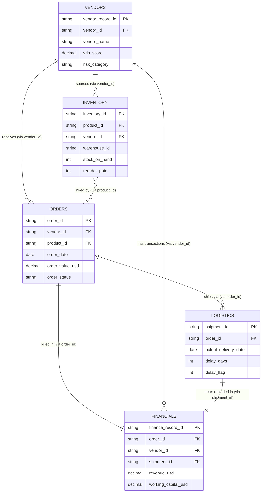

# Dataset Understanding & Architecture Report
**Project:** NexaChain Intelligence Platform
**Phase:** Task 2 - Dataset Familiarization

## 1. Dataset Portfolio Overview
Based on the official metadata document, the NexaChain ecosystem consists of 5 core enterprise datasets comprising over 310,000 records.

1. **Orders (`orders.csv`):** The central fact table capturing customer orders, fulfillment, and profitability. (120,000+ rows)
2. **Inventory (`inventory.csv`):** Daily inventory snapshots tracking stock levels, warehouse movements, and stockout risks. (55,000+ rows)
3. **Vendors (`vendors.csv`):** Monthly vendor performance snapshots powering the Vendor Risk Intelligence Score (VRIS). (22,000+ rows)
4. **Logistics (`logistics.csv`):** Shipment records capturing carrier performance, route details, and delivery delays. (85,000+ rows)
5. **Financials (`financials.csv`):** Weekly financial records integrating revenue, OPEX, and working capital metrics. (65,000+ rows)

## 2. Dataset Relationship Diagram (ERD)
The datasets are interconnected via shared foreign keys to enable multi-domain analytics. The Orders dataset serves as the central hub.

## 3. Key Relationships
* **Orders ↔ Logistics (1:N):** 1 order may have multiple shipments (split deliveries). Linked via `order_id`.
* **Orders ↔ Inventory (M:N):** Orders contain products, which are tracked in inventory. Linked via `product_id`.
* **Orders ↔ Vendors (N:1):** Multiple orders come from the same vendor. Linked via `vendor_id`.
* **Orders ↔ Financials (1:1):** Each order has a corresponding financial record. Linked via `order_id`.
* **Logistics ↔ Financials (1:1):** Each shipment has cost records in Financials. Linked via `shipment_id`.

## 4. Known Data Quality Issues (To verify in Task 3)
* **Orders:** ~3% duplicate `order_id`, ~5% NULL `delivery_date`.
* **Inventory:** ~4% NULL `reorder_point`, negative `stock_on_hand` values.
* **Vendors:** ~8% NULL `quality_score`, past `contract_expiry_date` without renewal.
* **Logistics:** ~6% `fuel_cost_usd` outliers, missing `delay_reason` for late shipments.
* **Financials:** ~6% NULL `working_capital_ratio`, duplicate records from AS/400.
